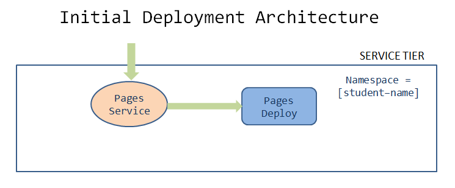

= Deploy Pages Microservice using Continuous Integration/Deployment
:stylesheet: boot-flatly.css
:nofooter:
:data-uri:

This lab demonstrates the concepts of continuous integration/continuous deployment (CI/CD) for our development.
We will be leveraging `Github Actions` which comes integrated with Github, for automating the process of CI/CD.

== Learning Outcomes
After completing the lab, you will be able to:

 . Describe how to create deployment and service for Pages Microservice
 . Describe how to create pipeline using Github Actions
 . Continuously deploy your code to Kubernetes cluster
 
== Starting to Kubernetize
   
Before starting the lab, verify the pages image created in the previous lab exists in
 link:https://hub.docker.com["docker hub", window="_blank"]

Below is the inital version of deployment architecture for `pages microservice` which will evolve as our application evolves.

 

=== Complete the following  tasks to implement the above architecture

. All the below tasks are assumed to be implemented inside `~/.workspace/pages` directory

. Get your cluster namespace from the instructors, which will be used in the next steps.

. Create a `~/workspace/kubernetes-manifests/pages/namespace.yaml` with the below manifest file.

+
[source,yaml]
-------------
apiVersion: v1
kind: Namespace
metadata:
  name: [student-name]

-------------

.  Create `~/workspace/kubernetes-manifests/pages/deployment.yaml` from the root project folder

+
[source,yaml]
-------------
apiVersion: apps/v1
kind: Deployment
metadata:
  labels:
    app: pages
  name: pages
  namespace: [student-name]
spec:
  replicas: 1
  selector:
    matchLabels:
      app: pages
  strategy: {}
  template:
    metadata:
      labels:
        app: pages
    spec:
      containers:
        - image: [docker-username]/pages:[tag]
          name: pages
          ports:
            - containerPort: 8080

-------------

. Create `~/workspace/kubernetes-manifests/pages/service.yaml` to expose the deployment as type `NodePort`
+
[source,yaml]
-------------
apiVersion: v1
kind: Service
metadata:
  labels:
    app: pages
  name: pages
  namespace: [student-name]
spec:
  ports:
  - port: 8080
    protocol: TCP
    targetPort: 8080
  selector:
    app: pages
  type: NodePort
-------------

=== Deploy to minikube cluster

. Start minikube locally
`minikube start --driver=virtualbox`

. Verify the kubectl context `kubectl config get-contexts` is set to minikube. If not, set it to minikube `kubectl config use-context minikube`

. Create kubernetes objects

+
[source,java]
-------------------
kubectl create namespace [student-name]
kubectl apply -f ~/workspace/kubernetes-manifests/pages/service.yaml
kubectl apply -f ~/workspace/kubernetes-manifests/pages/deployment.yaml
-------------------

. Verify the created objects

+
[source,java]
-------------------
kubectl get deployment pages --namespace [student-name]
kubectl get service pages --namespace [student-name]
-------------------

. Set up `[student-name]` namespace to point to the current context
+
[source,java]
-------------------
kubectl config set-context --current --namespace=[student-name]
-------------------

.   Access the application by port-forwarding on `localhost:8080`
+
[source,java]
-------------------
kubectl port-forward svc/pages 8080:8080

curl localhost:8080
-------------------

== Set-up Github Actions

. Configure the jobs within the pipeline workflow.

+
[source,java]
-----------

Pipeline workflow:

 Job sequence in the workflow:

 1.build-artifact ---> 2.deploy-to-cluster
 
 Tasks within each job:
 1.build-artifact: 
   a.Build with Gradle
   b.Upload Artifact 
   c.Build-Docker-Image

 2.deploy-to-cluster:
   a.Install Kubectl
   b.Configure AWS credentials
   c.Login to production cluster
   d.Create K8s deployments and resources
-----------

. Create the following secrets in github

+
[source,java]
-----------
DOCKER_USERNAME
DOCKER_PASSWORD
AWS_ACCESS_KEY_ID
AWS_SECRET_ACCESS_KEY
-----------

. To add secrets, click on settings and select secrets from the left navigation menu within the github repository. 

. The aws access key id and secret will be provided to you.

. Create `~/workspace/pages/.github/workflows/pipeline.yaml` with the CI/CD configuration <<EKS-Pipeline.adoc#eks, pipeline.yaml>>

. Copy the contents of the pages manifest into a new directory inside pages to be used for CI/CD
+
[source, shell script]
-----------
 mkdir ~/workspace/pages/deployment
 cp ~/workspace/kubernetes-manifests/pages/* ~/workspace/pages/deployment
-----------

. Update the image tag name to `pipeline` in the `pages` deployment

. Push your code to git repository
. Navigate to `Actions` tab in the github dashboard to see the progress of the pipeline.

=== Switch to the production cluster

. Get the list of clusters configured inside `kubeconfig` file

+
[source, shell script]
-------------------
kubectl config get-contexts
-------------------

. Copy the full name of the cluster emitted from command above.
If you are using EKS (public cloud), it might look similar to *arn:aws:*---*:cluster/*cluser-name**
+
Check with the instructors for the cluster name if you get more than one cluster apart from `minikube` from the previous command

. Switch the `kubectl` context to point to the production cluster

+
[source, shell script]
-------------------
kubectl config use-context [name of the cluster]

kubectl config set-context --current --namespace [student-name]

-------------------

. Verify that a new image for `pages` with the tag `pipeline` was created in your `dockerhub` account
. Upon successful completion of the workflow, you should be able to see the deployment and other objects in K8s cluster.

+
[source, shell script]
-------------------
kubectl get deploy
kubectl get svc
kubectl get po

-------------------
. Test the application once as you did earlier, to verify that it is behaving as expected

. Switch back to the minikube cluster before heading to the next lab
+
[source, shell script]
-------------------
kubectl config use-context minikube
-------------------

== Discussions: Advanced Usecases
. Automating security concerns
. Automating code quality compliance
. Advanced testing using test clusters
. Deployment strategies