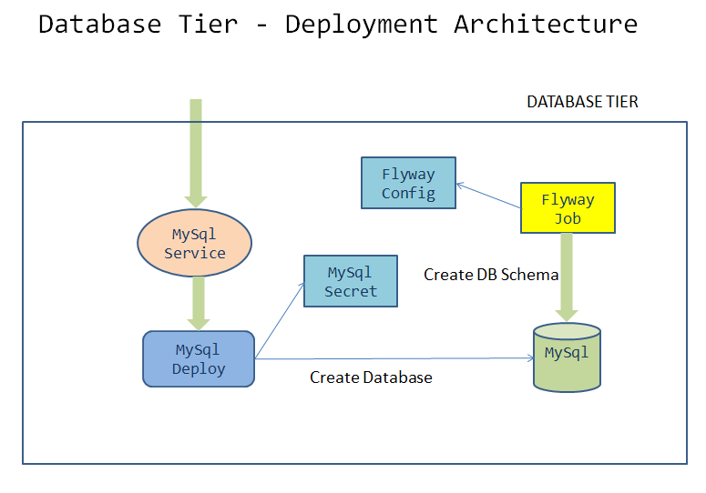

= Pages microservice - Design and Develop Database Tier
:stylesheet: boot-flatly.css
:nofooter:
:data-uri:
:linkattrs:
:icons: font

The architecture of pages microservice consists of two major components, database tier and service tier.
In this lab, we will focus only on the database tier. 
The database tier will be developed and deployed first, which paves the way for developing the application/service tier. 

We will use database migrations for versioning our schema changes as our database evolves.
There are various automation tools for implementing the database migrations. We will be using `Flyway`, as it is well adopted and widely accepted in the spring boot community.

== Learning Outcomes
After completing the lab, you will be able to:

 . Develop the Database Tier using MySql
 . Create MySql deployment in K8s
 . Expose MySql to be discovered by other services within the cluster
 . Implement Database Migrations using Flyway locally and on the production cluster
 . Leverage the concept of K8s Jobs for background processing
   
== Creating the database locally

. In order to create the database and schema, we need the DDL and DML scripts.

. Create `~/workspace/pages/database/create_database.sql` which contains sql script for creating the database `pages` and user `pages_user` for developing and testing locally with following contents

+

[source,sql]
----------
DROP DATABASE IF EXISTS pages;
CREATE DATABASE pages;

CREATE USER IF NOT EXISTS 'pages_user'@'%'
IDENTIFIED BY 'password';

GRANT ALL PRIVILEGES ON pages.* TO 'pages_user'@'%';
----------

. Create `~/workspace/pages/database/migrations/V1__initial_schema.sql` which contains the script for creating the schema with following contents

+

[source,sql]
----------
USE pages;
create table pages(
id bigint(20) not null auto_increment,
business_name VARCHAR(50),
address VARCHAR(50),
category_id bigint(20),
contact_number VARCHAR(50),
primary key (id)
)
engine = innodb
default charset = utf8;
----------

. Create the database locally

+
[source,java]
----------
cd ~/workspace/pages
mysql -uroot < database/create_database.sql
----------
They do not have any tables yet.
.   Run the flyway database migration command to create the schema

+
[source,java]
----------
flyway  -url="jdbc:mysql://localhost:3306/pages" -user=pages_user -password=password  -locations=filesystem:database migrate
----------

. Inspect the database created locally using mysql client.

+
[source,java]
----------
mysql -u pages_user -p
Enter password: ********
use pages;
describe pages;
----------

== Kubernetize the Database Tier

 

. Create the directory structure for kubernetes manifest files

+
[source,shell script]
----------
mkdir -p ~/workspace/kubernetes-manifests/{pages,mysql}
cd ~/workspace/kubernetes-manifests/mysql
----------

.  Create the secret manifest file `~/workspace/kubernetes-manifests/mysql/secret.yaml`

+
*Specification:*

+
[horizontal]
name:: mysql
namespace:: [your namespace]
spring.datasource.password:: [base64 encoded password]
password:: [base64 encoded password]

. For generating base64 encoded password use one of the 2 methods below

* Use dry-run option to get the yaml for the secret in imperative way
+
[source, java]
------------------
kubectl create secret generic mysql --namespace=[student-name] --from-literal=spring.datasource.password=password --from-literal=password=password --dry-run=client -o yaml
------------------

+
* Use the command  `echo -n password | base64` and copy that into the yaml file if you want to write the yaml from scratch.

+
For more information refer to http://kubernetes.io/docs

.  Create the file `~/workspace/kubernetes-manifests/mysql/deployment.yaml` containing the manifest for mysql deployment

+
*Specification:*

+
[horizontal]
name:: mysql
namespace:: [your namespace]
labels:: app:pages, tier:database
image:: mysql:8.0
container-name:: mysql
containerPort:: 3306
volume Name:: mysql-persistent-storage
volume Type:: emptyDir{}
mountPath:: mountPath: /var/lib/mysql
EnvironmentVariables::

* MYSQL_SERVICE_HOST: "mysql"
* MYSQL_SERVICE_PORT: 3306
* MYSQL_DATABASE: pages
* MYSQL_ROOT_PASSWORD: value from a secret called mysql-pass with key-name as password.

+
.Solution

[source, yaml]
------------------
apiVersion: apps/v1
kind: Deployment
metadata:
  name: mysql
  namespace: [student-name]
  labels:
    app: pages
    tier: database
spec:
  selector:
    matchLabels:
      app: pages
      tier: database
  strategy:
    type: Recreate
  template:
    metadata:
      labels:
        app: pages
        tier: database
    spec:
      containers:
        - image: mysql:8.0
          name: mysql
          env:
            - name: MYSQL_ROOT_PASSWORD
              valueFrom:
                secretKeyRef:
                  name: mysql
                  key: password
            - name: MYSQL_SERVICE_HOST
              value: "mysql"
            - name: MYSQL_SERVICE_PORT
              value: "3306"
            - name: MYSQL_DATABASE
              value: "pages"
          ports:
            - containerPort: 3306
              name: mysql
          volumeMounts:
            - name: mysql-persistent-storage
              mountPath: /var/lib/mysql
      volumes:
        - name: mysql-persistent-storage
          emptyDir: {}
------------------
.  Create the `~/workspace/kubernetes-manifests/mysql/service.yaml` with the manifest for exposing the mysql deployment with following specs:
+
[source, yaml]
------------------
apiVersion: v1
kind: Service
metadata:
  name: mysql
  namespace: [student-name]
  labels:
    app: pages
    tier: database
spec:
  ports:
    - port: 3306
  selector:
    app: pages
    tier: database
  type: ClusterIP
------------------

.  Create the file `~/workspace/kubernetes-manifests/mysql/configmap.yaml` containing the manifest for `configmap` used by `flyway`

+
*Specification:*

+
[horizontal]
name:: mysql
namespace:: [your namespace]
data::
* spring.datasource.username: root
* V1\__inital_schema.sql: This should be the content of your `~/workspace/pages/database/migrations/V1__inital_schema.sql`

+
[source, yaml]
------------------
apiVersion: v1
kind: ConfigMap
metadata:
  name: mysql
  namespace: [student-name]
data:
  spring.datasource.username: root

  V1__inital_schema.sql: |
    USE pages;
    create table pages(
    id bigint(20) not null auto_increment,
    business_name VARCHAR(50),
    address VARCHAR(50),
    category_id bigint(20),
    contact_number VARCHAR(50),
    primary key (id)
    )
    engine = innodb
    default charset = utf8;
------------------

.  Create the file `~/workspace/kubernetes-manifests/mysql/flyway-job.yaml` containing the manifest for running a K8s job to execute flyway migration commands
+
[source, yaml]
------------------
apiVersion: batch/v1
kind: Job
metadata:
  name: flyway-job
  namespace: [student-name]
  labels:
    app: pages
spec:
  template:
    spec:
      containers:
        - name: flyway
          image: flyway/flyway:6.4.4
          args:
            - info
            - migrate
            - info
          env:
            - name: FLYWAY_URL
              value: jdbc:mysql://mysql/pages
            - name: FLYWAY_USER
              value: root
            - name: FLYWAY_PASSWORD
              valueFrom:
                secretKeyRef:
                  name: mysql
                  key: password
            - name: FLYWAY_PLACEHOLDER_REPLACEMENT
              value: "true"
            - name: FLYWAY_PLACEHOLDERS_USERNAME
              valueFrom:
                configMapKeyRef:
                  name: mysql
                  key: spring.datasource.username
            - name: FLYWAY_PLACEHOLDERS_PASSWORD
              valueFrom:
                secretKeyRef:
                  name: mysql
                  key: spring.datasource.password
          volumeMounts:
            - mountPath: /flyway/sql
              name: sql
      volumes:
        - name: sql
          configMap:
            name: mysql
      restartPolicy: Never
------------------

== Testing locally

. Switch the `kubectl` context to `minikube` and set the context to point to your namespace.
. Create all the  5 resources inside your namespace. Wait for some time for the migration job to complete. Verify the resources were created without errors.

+
[source, shell script]
------------------
kubectl apply -f ~/workspace/kubernetes-manifests/mysql/secret.yaml
kubectl apply -f ~/workspace/kubernetes-manifests/mysql/configmap.yaml
kubectl apply -f ~/workspace/kubernetes-manifests/mysql/service.yaml
kubectl apply -f ~/workspace/kubernetes-manifests/mysql/deployment.yaml
kubectl apply -f ~/workspace/kubernetes-manifests/mysql/flyway-job.yaml
------------------

. To verify the database was created with the table `pages` use `kubectl exec` to get a shell to the `mysql` container +
+
[source,textmate]
------------------
kubectl get pods
#copy the name of mysql pod
kubectl exec -it <pod-name> -- sh
mysql -uroot -p 
password 

show databases; 
use pages;
show tables;
describe pages;
exit ;
------------------

+
CAUTION: The background job will not be deleted automatically.
You will have to manually delete the flyway job by running `kubectl delete job flyway-job` once its has completed successfully.

=== The database tier is now ready to accept requests.