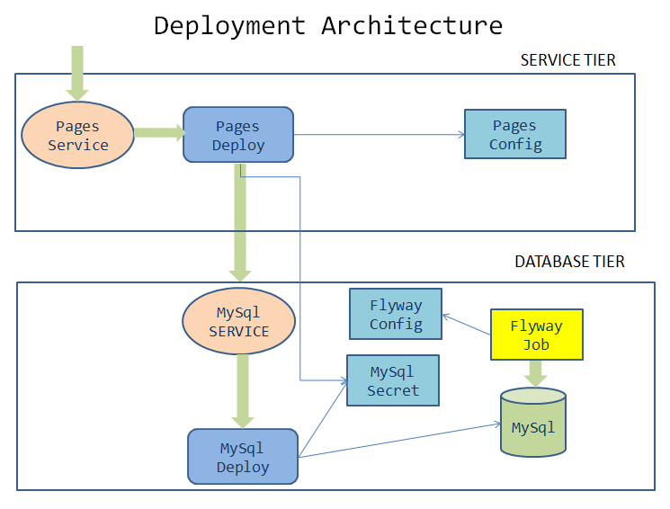

= Pages microservice - Design and Develop Service Tier
:stylesheet: boot-flatly.css
:nofooter:
:data-uri:
:linkattrs:
:icons: font

We will make use of the database tier created in the previous lab and implement our service tier to communicate with MySql database.

== Learning Outcomes
After completing the lab, you will be able to:

 . Design the deployment architecture for the service-tier consisting of a single microservice.
 . Deploy the service tier in conformance to the deployment architecture
 . Understand native K8s service discovery by using labels and selectors to discover database service deployed in the previous lab.
 . Understand testing REST APIs using curl commands

== Develop the pages microservice

.  Docker image of pages microservice is available in the image registry. We will be focusing on designing the deployment architecture.
.  It is necessary to understand the configuration requirements and dependecies, if any, in order for the application to work properly once deployed.
. Let us examine the deployment architecture. The microservice is composed of a 2 tier architecture and we have already deployed the database tier. In order to complete the design:
.. We will have to design the service tier
.. Look at the dependecies and figure out a way to connect the database tier with the service tier

== Connecting service tier with database tier

 

== Kubernetize

. Update the pages deployment manifest file by setting the container image to `public.ecr.aws/z8i8u8l0/kal:service`

. The pages service needs to connect to the mysql database. The communication happens through  `mysql service` that we created in the previous lab.

+
However, the pages application depends on the connection string which enables the application to talk to the database.

+
For this, we will have to set certain environment variables which takes care of it. Update the pages deployment by adding environment variables to the container

+
[horizontal]
PAGE_CONTENT:: Value from configmap name `pages` with key name `PAGE_CONTENT`
SPRING_DATASOURCE_URL::  jdbc:mysql://mysql/pages
SPRING_DATASOURCE_USERNAME:: "root"
SPRING_DATASOURCE_PASSWORD::  Value from secret name `mysql` with key name `password`

[start=3]
. The updated `~./workspace/kubernetes-manifests/pages/deployment.yaml` manifest file

+
[source, yaml]
------------------
apiVersion: apps/v1
kind: Deployment
metadata:
  labels:
    app: pages
    tier: service
  name: pages
  namespace: [student-name]
spec:
  replicas: 1
  selector:
    matchLabels:
      app: pages
      tier: service
  strategy: {}
  template:
    metadata:
      labels:
        app: pages
        tier: service
    spec:
      containers:
        - image: public.ecr.aws/z8i8u8l0/kal:service
          name: pages
          ports:
            - containerPort: 8080
          env:
            - name: PAGE_CONTENT
              valueFrom:
                configMapKeyRef:
                  name: pages
                  key: PAGE_CONTENT
            - name: SPRING_DATASOURCE_URL
              value: jdbc:mysql://mysql/pages?useSSL=false
            - name: SPRING_DATASOURCE_USERNAME
              value: "root"
            - name: SPRING_DATASOURCE_PASSWORD
              valueFrom:
                secretKeyRef:
                  name: mysql
                  key: password

------------------

. Delete the pages deployment. This is not recommended in production, however we want to ensure that we have a fresh deployment for local testing.
`kubectl delete deploy pages`

== Testing locally on minikube

. Switch the kubectl context to minikube - `kubectl config use-context minikube`
+
Set the kubectl context namespace to your namespace - `kubectl config set-context --current --namespace [student-name]`

. Since the pages service is updated with new labels, updating the immutable propery of the service is not allowed. Delete the service

+
`kubectl delete svc pages`

. Create the service 

+
`kubectl apply -f deployment/pages-service.yaml`

. Create pages deployment.
+
`kubectl apply -f deployment/pages-deployment.yaml`

+
. Port forward to connect to pages service running inside K8s from the local machine
+
`kubectl port-forward svc/pages 8080:8080`

. Test the pages application by performing CRUD operations using curl/postman. 
 Refer <<07-Pages-Curl-Commands.adoc#pages-curl-section, Pages Curl Guide>> for testing.

== Task Accomplished

We completed integrating the service-tier with the database-tier & successfully deployed a two-tier cloud native application to K8s cluster.