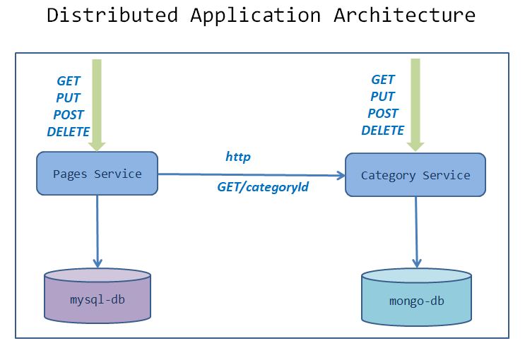

= Deploying distributed microservice application and Service Discovery
:stylesheet: boot-flatly.css
:nofooter:
:data-uri:

In this lab we will design the deployment architecture of a distributed application comprising of pages and category microservices and deploy them on K8s cluster.
We will be addressing service to service communication scenario.

== Learning Outcomes
After completing the lab, you will be able to:

 . Understand the dependencies of applications in a microservices architecture
 . Design and implement deployment architecture for a distributed system
 . Understand and implement service discovery concepts in Kubernetes and its influence on microservice applications
 . Explain the concepts of client side load-balancing and server side load-balancing
 . Understand the concepts of RBAC and its relevance to deploying microservices in Kubernetes

== Service dependencies

. The pages microservice depends on the category microservice for fetching the `category` based on the `categoryId` in order to validate the business rules.
. The `page` entity should not be associated with a non-existing or an invalid `category/categoryId`, which would lead to inconsistency within the system.
  This is the feature implemented and both the applications have addressed this scenario.
. The new image that has implemented this feature for pages and category would be `dellcloud/pages:distributed` and `dellcloud/category:distributed` respectively

== Design
. During a POST request to pages service, the `categoryId` has to be validated against an existing category.
. Category application has to be discoverable by pages application. How would you design this?
. Pages should be relying on a `client side load-balancing` feature in order to automatically discover at which endpoint(s) it can reach the Category service.
. Client side load-balancing enables Kubernetes client to populate metadata of interested endpoints.

== Create RBAC
. In order for the application to access kubernetes resources such as `endpoints`, for our usecase, the access permission has to be provided as a `role` to the application and bound to the `service account` which the application is linked to, by means of `RBAC` (Role based access controler).
__ If the service account does not authorize permission to access K8s resources, a `Forbidden` error will be thrown, since K8s internally uses `RBAC` for security__
. Through RBAC, the security is emphasised within kubernetes and our applications will be authorized for accessing the permitted resources
. Lets provide `RBAC` access to these resources by creating `ClusterRole` and `RoleBinding` to the `default` service account within your namespace.

. Create `rbac.yaml` with the below contents in `~/workspace/kubernetes-manifests/pages` folder which is needed by the pages application.
Once we create this within the cluster there will be no need to repeat it for category application as both share the same namespace and service accounts.
+
[source,yaml]
----------
kind: ClusterRole
apiVersion: rbac.authorization.k8s.io/v1
metadata:
  name: [student-name]-cluster-role
rules:
  - apiGroups: [""] # "" indicates the core API group
    resources: ["services", "pods", "configmaps", "endpoints"]
    verbs: ["get", "watch", "list"]

---
kind: RoleBinding
apiVersion: rbac.authorization.k8s.io/v1
metadata:
  name: default:[student-name]-cluster-role-binding
roleRef:
  apiGroup: rbac.authorization.k8s.io
  kind: ClusterRole
  name: [student-name]-cluster-role
subjects:
  - kind: ServiceAccount
    name: default
    namespace: [student-name]

----------

== Deployment Guide

=== Clean up resources
. Delete all existing deployments `kubectl delete deploy,svc --all`

. Delete any persistent volume and persistent volume claims

. Clean up the resources by deleting `[student-name]` namespace.
+
[source, shell script]
-------------------
kubectl delete namespace [student-name]
-------------------

=== Deploy Category microservice
. Create `[student-name]` namespace.
+
[source, shell script]
-------------------
kubectl apply -f ~/workspace/kubernetes-manifests/pages/namespace.yaml
-------------------

. Set up `[student-name]` namespace to point to the current context. If the namespace is not created, the deployments will not work.
+
[source, shell script]
-------------------
kubectl config set-context --current --namespace=[student-name]
-------------------

. Create the Database tier
+
[source, shell script]
-------------------
kubectl apply -f ~/workspace/kubernetes-manifests/mongo/storage-class.yaml
kubectl apply -f ~/workspace/kubernetes-manifests/mongo/pv.yaml
kubectl apply -f ~/workspace/kubernetes-manifests/mongo/pvc.yaml
kubectl apply -f ~/workspace/kubernetes-manifests/mongo/service.yaml
kubectl apply -f ~/workspace/kubernetes-manifests/mongo/deployment.yaml
-------------------  

. Verify the deployment of database tier

+
[source, shell script]
-------------------
kubectl get deployment mongo 
kubectl get service mongo 
kubectl get pvc
-------------------

. Proceed further if there are no errors, otherwise troubleshoot and fix them.

. Create the service tier
+
[source, shell script]
-------------------
kubectl apply -f ~/workspace/kubernetes-manifests/category/service.yaml
kubectl apply -f ~/workspace/kubernetes-manifests/category/deployment.yaml
-------------------  

. Verify the deployment of service tier

+
[source, shell script]
-------------------
kubectl get deployment category 
kubectl get service category 
-------------------

.   Access the category application
+
[source, shell script]
-------------------
kubectl port-forward svc/category 8080:8080
-------------------

+
. Refer <<10-Category-Curl-Commands.adoc#category-curl-section, Category Curl Guide>> for testing and proceed with the next steps

=== Deploy Pages microservice
. Create the Database tier
+
[source, shell script]
-------------------
kubectl apply -f ~/workspace/kubernetes-manifests/pages/rbac.yaml
kubectl apply -f ~/workspace/kubernetes-manifests/mysql/storage-class.yaml
kubectl apply -f ~/workspace/kubernetes-manifests/mysql/pv.yaml
kubectl apply -f ~/workspace/kubernetes-manifests/mysql/pvc.yaml
kubectl apply -f ~/workspace/kubernetes-manifests/mysql/service.yaml
kubectl apply -f ~/workspace/kubernetes-manifests/mysql/secret.yaml
kubectl apply -f ~/workspace/kubernetes-manifests/mysql/deployment.yaml
kubectl apply -f ~/workspace/kubernetes-manifests/mysql/configmap.yaml
kubectl apply -f ~/workspace/kubernetes-manifests/mysql/flyway-job.yaml

-------------------  

. Verify the deployment of database tier

+
[source, shell script]
-------------------
kubectl get deployment mysql 
kubectl get service mysql
kubectl get pvc
kubectl get jobs
-------------------

. Create the Service tier
+
[source, shell script]
-------------------
kubectl apply -f ~/workspace/kubernetes-manifests/pages/config.yaml
kubectl apply -f ~/workspace/kubernetes-manifests/pages/service.yaml
kubectl apply -f ~/workspace/kubernetes-manifests/pages/deployment.yaml
-------------------

. Verify the deployment of database tier

+
[source, shell script]
-------------------
kubectl get deploy
kubectl get svc 
-------------------

. Proceed further if there are no errors, otherwise troubleshoot and fix them.
. Connect to the pages service by port-forwarding for testing.
`kubectl port-forward svc/pages 8080:8080`

. Test the pages application by performing CRUD operations using curl/postman. 
 Refer <<07-Pages-Curl-Commands.adoc#pages-curl-section, Pages Curl Guide>> for testing. Add a few category entries first into category service and then test the validation rules for pages, to check if the functionality works as expected

== Task Accomplished

We deployed a distributed microservice based application to K8s cluster by understanding the dependencies between the microservices and addressed service to service communication scenario
